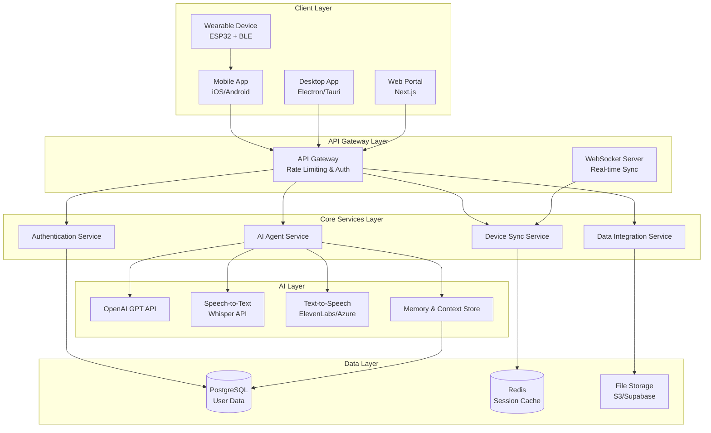

# BIL Core System Design

## Overview

The BIL Core System is designed as a distributed personal AI assistant ecosystem with a cloud-based backend that orchestrates interactions across multiple client devices. The architecture follows a hub-and-spoke model where the Core API serves as the central intelligence hub, while various client devices (mobile apps, desktop applications, and wearable devices) act as interaction endpoints.

The system emphasizes real-time synchronization, natural language processing, and seamless cross-device experiences while maintaining strong security and privacy controls.

## Architecture

### High-Level Architecture



### Communication Flow

1. **Device Registration**: Devices authenticate through OAuth2/JWT tokens
2. **Real-time Sync**: WebSocket connections maintain live state across devices
3. **Voice Processing**: Audio streams through STT → AI Agent → TTS pipeline
4. **Context Management**: Conversation history and user preferences stored in memory layer
5. **Cross-device Handoff**: Active conversations can be transferred between devices seamlessly

## Components and Interfaces

### Core API Service

**Technology Stack**: Node.js with Express/Fastify
**Responsibilities**:

- Central orchestration of all system components
- Authentication and authorization management
- Request routing and load balancing
- Rate limiting and security enforcement

**Key Endpoints**:

```typescript
// Authentication
POST /auth/login
POST /auth/register
POST /auth/refresh
DELETE /auth/logout

// AI Agent Interaction
POST /agent/chat
POST /agent/voice
GET /agent/history
DELETE /agent/history/:id

// Device Management
GET /devices
POST /devices/register
PUT /devices/:id/sync
DELETE /devices/:id

// User Data Integration
GET /data/calendar
GET /data/files
POST /data/permissions
```

### AI Agent Service

**Technology Stack**: Python with FastAPI
**Responsibilities**:

- Natural language processing and response generation
- Conversation context management
- Personality and preference adaptation
- Integration with external AI services

**Core Components**:

```python
class AIAgent:
    def __init__(self):
        self.llm_client = OpenAIClient()
        self.memory_store = MemoryStore()
        self.context_manager = ContextManager()

    async def process_message(self, user_id: str, message: str, device_context: dict):
        # Retrieve conversation history and user preferences
        context = await self.context_manager.get_context(user_id)

        # Generate AI response with context
        response = await self.llm_client.generate_response(
            message, context, device_context
        )

        # Update memory and context
        await self.memory_store.store_interaction(user_id, message, response)

        return response
```

### Device Sync Service

**Technology Stack**: Node.js with Socket.io
**Responsibilities**:

- Real-time state synchronization across devices
- Device presence and capability management
- Cross-device conversation handoff
- Conflict resolution for concurrent interactions

**Sync Protocol**:

```typescript
interface SyncMessage {
  type: 'conversation_update' | 'device_status' | 'user_preference';
  userId: string;
  deviceId: string;
  timestamp: number;
  payload: any;
}

class DeviceSyncManager {
  async broadcastToUserDevices(userId: string, message: SyncMessage) {
    const userDevices = await this.getActiveDevices(userId);
    userDevices.forEach(device => {
      this.socketServer.to(device.socketId).emit('sync', message);
    });
  }
}
```

### Mobile Application

**Technology Stack**: React Native with Expo
**Key Features**:

- Voice input with wake word detection
- Real-time chat interface
- Device management and settings
- Offline capability for basic functions

**Core Components**:

```typescript
// Voice Interface Component
const VoiceInterface = () => {
    const [isListening, setIsListening] = useState(false);
    const [transcript, setTranscript] = useState('');

    const startListening = async () => {
        const { status } = await Audio.requestPermissionsAsync();
        if (status === 'granted') {
            // Start voice recording and STT processing
            await VoiceRecognition.start({
                onResult: (result) => setTranscript(result),
                onEnd: () => sendToAI(transcript)
            });
        }
    };

    return (
        <VoiceButton onPress={startListening} isActive={isListening} />
    );
};
```

### Wearable Device (Culon)

**Technology Stack**: Arduino/ESP32 with BLE
**Key Features**:

- Wake word detection ("Hey BIL")
- Haptic feedback patterns
- Voice data transmission to mobile app
- Basic gesture recognition

**Firmware Architecture**:

```cpp
class CulonDevice {
private:
    BLEServer* bleServer;
    BLECharacteristic* audioCharacteristic;
    VoiceDetector voiceDetector;
    HapticController hapticController;

public:
    void setup() {
        initializeBLE();
        voiceDetector.setWakeWord("Hey BIL");
        hapticController.initialize();
    }

    void loop() {
        if (voiceDetector.detectWakeWord()) {
            hapticController.confirmationPattern();
            startVoiceRecording();
        }

        if (bleServer->getConnectedCount() > 0) {
            processIncomingCommands();
        }
    }
};
```

### Desktop Application

**Technology Stack**: Electron with React
**Key Features**:

- System tray integration
- Global keyboard shortcuts
- File system access for document queries
- Screen sharing capabilities for visual context

## Data Models

### User Model

```typescript
interface User {
  id: string;
  email: string;
  name: string;
  preferences: UserPreferences;
  devices: Device[];
  createdAt: Date;
  lastActiveAt: Date;
}

interface UserPreferences {
  voiceSettings: {
    preferredVoice: string;
    speechRate: number;
    wakeWordSensitivity: number;
  };
  privacySettings: {
    dataRetentionDays: number;
    allowDataIntegration: boolean;
    permittedDataSources: string[];
  };
  aiPersonality: {
    responseStyle: 'formal' | 'casual' | 'friendly';
    verbosity: 'concise' | 'detailed';
    proactiveness: number; // 1-10 scale
  };
}
```

### Device Model

```typescript
interface Device {
  id: string;
  userId: string;
  type: 'mobile' | 'desktop' | 'wearable' | 'web';
  name: string;
  capabilities: DeviceCapabilities;
  lastSeen: Date;
  isActive: boolean;
  connectionInfo: ConnectionInfo;
}

interface DeviceCapabilities {
  hasVoiceInput: boolean;
  hasVoiceOutput: boolean;
  hasHapticFeedback: boolean;
  hasFileAccess: boolean;
  hasCalendarAccess: boolean;
  supportsGestures: boolean;
}
```

### Conversation Model

```typescript
interface Conversation {
  id: string;
  userId: string;
  messages: Message[];
  context: ConversationContext;
  createdAt: Date;
  updatedAt: Date;
}

interface Message {
  id: string;
  role: 'user' | 'assistant';
  content: string;
  deviceId: string;
  timestamp: Date;
  metadata: {
    inputMethod: 'voice' | 'text' | 'gesture';
    processingTime: number;
    confidence?: number;
  };
}

interface ConversationContext {
  activeTopics: string[];
  userMood: string;
  currentLocation?: string;
  recentActivities: string[];
  relevantFiles: string[];
}
```

## Error Handling

### Error Categories and Responses

1. **Authentication Errors**
   - Invalid credentials: Return 401 with clear error message
   - Expired tokens: Automatically attempt refresh, fallback to re-authentication
   - Device not authorized: Require device re-registration

2. **AI Processing Errors**
   - LLM API failures: Fallback to cached responses or simplified processing
   - Speech recognition errors: Request user to repeat or switch to text input
   - Context retrieval failures: Continue with limited context, log for investigation

3. **Device Communication Errors**
   - Bluetooth disconnection: Attempt automatic reconnection, notify user
   - Network timeouts: Queue messages for retry, provide offline mode
   - Sync conflicts: Use timestamp-based resolution with user notification

4. **Data Integration Errors**
   - Permission denied: Guide user through re-authorization flow
   - External API failures: Graceful degradation with user notification
   - Data corruption: Isolate affected data, attempt recovery from backups

### Error Recovery Strategies

```typescript
class ErrorHandler {
  async handleAIError(error: AIError, context: RequestContext) {
    switch (error.type) {
      case 'LLM_TIMEOUT':
        return await this.fallbackToCache(context);
      case 'CONTEXT_UNAVAILABLE':
        return await this.processWithLimitedContext(context);
      case 'RATE_LIMIT_EXCEEDED':
        return await this.queueForRetry(context);
      default:
        return this.generateErrorResponse(error);
    }
  }

  private async fallbackToCache(context: RequestContext) {
    const cachedResponse = await this.cache.getSimilarResponse(
      context.userId,
      context.message
    );
    return cachedResponse || this.generateFallbackResponse();
  }
}
```

## Testing Strategy

### Unit Testing

- **AI Agent Service**: Mock LLM responses, test context management logic
- **Device Sync**: Test message routing and conflict resolution
- **Authentication**: Verify token generation and validation
- **Data Models**: Test serialization, validation, and relationships

### Integration Testing

- **API Endpoints**: Test complete request/response cycles
- **WebSocket Communication**: Verify real-time sync across multiple connections
- **External Service Integration**: Test OpenAI API, speech services with mocked responses
- **Database Operations**: Test CRUD operations and data consistency

### End-to-End Testing

- **Cross-device Scenarios**: Test conversation handoff between devices
- **Voice Processing Pipeline**: Test complete STT → AI → TTS flow
- **Authentication Flow**: Test device registration and user login across platforms
- **Error Recovery**: Test system behavior under various failure conditions

### Performance Testing

- **Load Testing**: Simulate concurrent users and device connections
- **Latency Testing**: Measure response times for voice and text interactions
- **Memory Usage**: Monitor memory consumption during extended conversations
- **Battery Impact**: Test wearable device power consumption

### Security Testing

- **Authentication Security**: Test token security and session management
- **Data Privacy**: Verify encryption and access controls
- **API Security**: Test rate limiting and input validation
- **Device Security**: Test BLE security and device authorization

### Testing Tools and Framework

```typescript
// Example test structure
describe('AI Agent Service', () => {
  beforeEach(() => {
    mockLLMClient = new MockLLMClient();
    aiAgent = new AIAgent(mockLLMClient);
  });

  test('should maintain conversation context across messages', async () => {
    const userId = 'test-user';
    const firstMessage = 'Hello, my name is John';
    const secondMessage = 'What is my name?';

    await aiAgent.processMessage(userId, firstMessage, {});
    const response = await aiAgent.processMessage(userId, secondMessage, {});

    expect(response.content).toContain('John');
  });

  test('should handle LLM API failures gracefully', async () => {
    mockLLMClient.simulateFailure();

    const response = await aiAgent.processMessage('user', 'Hello', {});

    expect(response.content).toContain('temporarily unavailable');
    expect(response.error).toBe(false);
  });
});
```
